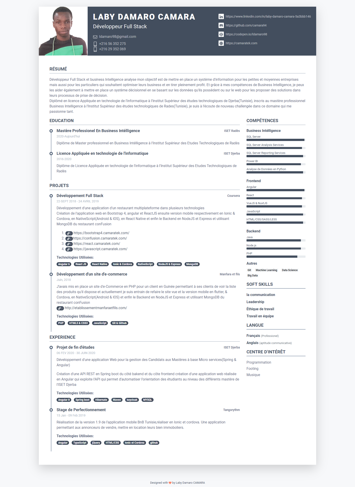

# Mon CV PERSO
Mon cv en HTML5 et CSS3
Ce projet est composé de cinq (5) fichiers à savoir:
1. le fichier **damarocv.css** qui contient les styles css3 appliqués à la page HTML
2.  le fichier **index.html** qui contient le contenu visible et le code HTML5
3.  et une image **laby.png** qui correspond à ma photo qui est affichée en haut à gauche de mon CV.
4.  le fichier **camaratek-2021-03-25.pdf** qui correspond à la version PDF
5.  le fichier **camaratek-2021-03-png** qui correspond à la version PNG
   
  

[Le lien du CV en ligne](cv2.camaratek.com)